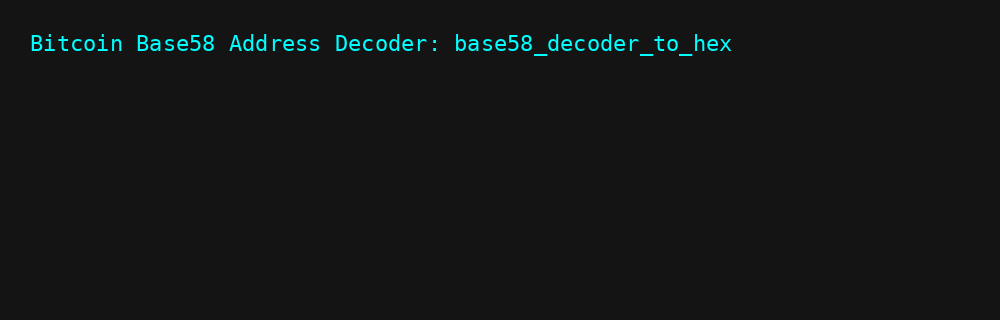

<p align="center">
  
</p>

> ⚠️ This project is deprecated. Please see [btc_address_analyzer](https://github.com/BitMorphX/btc_address_analyzer) instead.

# 🧪 BITCOIN BASE58 TO HEX DECODER

**Bitcoin Base58 to HEX Decoder** is a simple and effective CLI tool for decoding Bitcoin Base58 addresses into their raw hexadecimal components.

It takes a Base58-encoded Bitcoin address, decodes it, extracts the prefix, public key hash, and checksum, and verifies whether the checksum is valid.

- ✅ Instant Base58 decoding  
- ✅ HEX-format breakdown (prefix, public key hash, checksum)  
- ✅ Checksum verification  
- ✅ Color-coded terminal output

---

## ⚙️ Features

- 🧮 Decodes Bitcoin Base58 addresses  
- 📥 Displays prefix, public key hash, and checksum in HEX  
- ✅ Verifies checksum using double SHA-256  
- 🎨 Terminal output with `colorama`

---

## 📁 File Overview

- `base58_decoder_to_hex.py` – Main script for decoding  
- `base58_decoder_to_hex.bat` – Windows launcher  
- `.vscode/`  
  - `settings.json` – Editor preferences  
  - `launch.json` – Debugging configuration  
  - `tasks.json` – Task runner integration  
  - `extensions.json` – Recommended VS Code extensions  
- `README.md` – This documentation  
- `RELEASE_v2.0.0.md` – Release notes  
- `ETHICS.md` – Ethical usage guidelines  
- `LICENSE` – Project license  
- `NOTICE` – Legal attribution and reuse notice  
- `requirements.txt` – Python dependencies  

---

## 🛠️ Dependencies

```
base58
colorama
```

Install with:

```bash
pip install -r requirements.txt
```

> Python 3.8+ is recommended.

---

## 🚀 Usage

### Option 1 – via Python:
```bash
python base58_decoder_to_hex.py
```

### Option 2 – via `.bat` launcher (Windows):
```cmd
base58_decoder_to_hex.bat
```

- Input: Bitcoin address (Base58 format)  
- Output: Decoded HEX components + checksum validation  
- Interactive prompt and colored output in terminal

---

## 📦 Example Output

```
Bitcoin Base58 Address Decoder: base58_decoder_to_hex

-> Enter a Bitcoin address (Base58 format):
Address: 1BoatSLRHtKNngkdXEeobR76b53LETtpyT

Decoded Results:
Prefix (HEX): 00
Public Key Hash (HEX): 7680adec8eabcabac676be9e38354ade0bd22cdb
Checksum (HEX): 0bb960de

Checksum valid: ✓
```

---

## 🔗 Related Project

This decoding tool complements:

### 👉 [Bitcoin Address Formats](https://en.bitcoin.it/wiki/Technical_background_of_version_1_Bitcoin_addresses)

An official overview of Bitcoin's Base58Check encoding and address structure.

---

## 🎬 DEMO

<p align="center">
  
</p>

---

## 📂 Project Structure

```text
base58-decoder/
├── assets/
│   ├── banner.png
│   └── demo.gif
├── .vscode/
│   ├── settings.json
│   ├── launch.json
│   ├── tasks.json
│   └── extensions.json
├── base58_decoder_to_hex.py
├── base58_decoder_to_hex.bat
├── LICENSE
├── NOTICE
├── ETHICS.md
├── README.md
├── RELEASE_v2.0.0.md
└── requirements.txt
```

---

## ⚠️ DISCLAIMER

This software is provided strictly for **educational, analytical, and research purposes only**.

The author **does not promote or condone** any unethical behavior, unauthorized access, or abuse of blockchain systems or cryptographic tools.  
By using this code, you agree to accept **full responsibility for your actions and their consequences**.

This project **does not include or generate any real private keys** linked to actual cryptocurrency holdings.  
It is designed to operate in **offline environments** or for simulation/testing purposes, using random or mock data for learning.

**The author accepts no liability** for any damages, losses, or illegal use resulting from this software.  
All responsibility lies solely with the end user.

Any attempt to use this tool maliciously or exploitatively is **strictly prohibited** and may violate international laws.

> **Use responsibly. Learn ethically. Contribute honestly.**

---

## ⚖️ Ethical Use

This tool is created strictly for **research and educational purposes**.  
See [ETHICS.md](./ETHICS.md) for the full statement.

> ❗ Do not use this tool to attempt key collisions or unauthorized activity.  
> 🧠 Use responsibly and with integrity.

---

## 📜 License

Licensed under the [Apache 2.0 License](./LICENSE) by **BitMorphX**

---

## 📣 NOTICE

See [`NOTICE`](./NOTICE) for important information about attribution, DMCA protection, and reuse permissions.

---

## 🍱 Support

★ **Bitcoin (BTC)**  
`1MorphXyhHpgmYSfvwUpWojphfLTjrNXc7`

★ **Monero (XMR)**  
`86VAmEogaZF5WDwR3SKtEC6HSEUh6JPA1gVGcny68XmSJ1pYBbGLmdzEB1ZzGModLBXkG3WbRv12mSKv4KnD8i9w7VTg2uu`

★ **Dash (DASH)**  
`XtNuNfgaEXFKhtfxAKuDkdysxUqaZm7TDX`

**We also value early privacy coins such as:**  
★ **Bytecoin (BCN)**  
`bcnZNMyrDrweQgoKH6zpWaE2kW1VZRsX3aDEqnxBVEQfjNnPK6vvNMNRPA4S7YxfhsStzyJeP16woK6G7cRBydZm2TvLFB2eeR`

🙏 *Thank you for supporting independent research and ethical technology.*

---

## 👤 Author & Contact

🔗 GitHub: https://github.com/BitMorphX  
✉️ Email: BitMorphX@proton.me  
💬 Telegram: https://t.me/BitMorphX

> _“I morph bits, not to break, but to understand.”_  
> — **BitMorphX**

---

© BitMorphX – All rights reserved.
